# 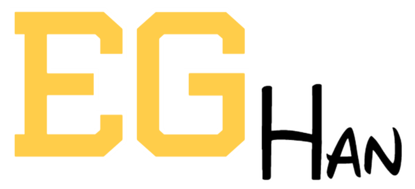 EG HAN 금융 상품 추천 서비스

## Index

#### &emsp; [➤ 프로젝트 소개](#프로젝트-소개) 

#### &emsp; [➤ 개발 환경](#개발-환경) 

#### &emsp; [➤ 기능 소개](#기능-소개) 

#### &emsp; [➤ 산출물](#산출물) 

#### &emsp; [➤ 팀 소개](#팀-소개) 

## 프로젝트 소개

**사용자 정보에 따른 금융 상품 추천 서비스**

- 다양한 예금, 적금 상품 조회 가능
- 사용자의 연령대, 자산, 연봉 별 금융 상품 추천
- 사용자들 간의 소통을 위한 자유 게시판
- 자신이 가입한 상품 금리를 그래프로 조회 가능

### 프로젝트 기간

**2024.05.16 ~ 2024.05.23 (총 1주)**

## 개발 환경

- BE: Django
- FE: Vue.js, Bootstrap
- DB : SQLite

### 협업 관리 툴

 

## 기능 소개

### 로그인

- **로그인 화면**: 로그인 탭을 통해 로그인을 할 수 있습니다.
  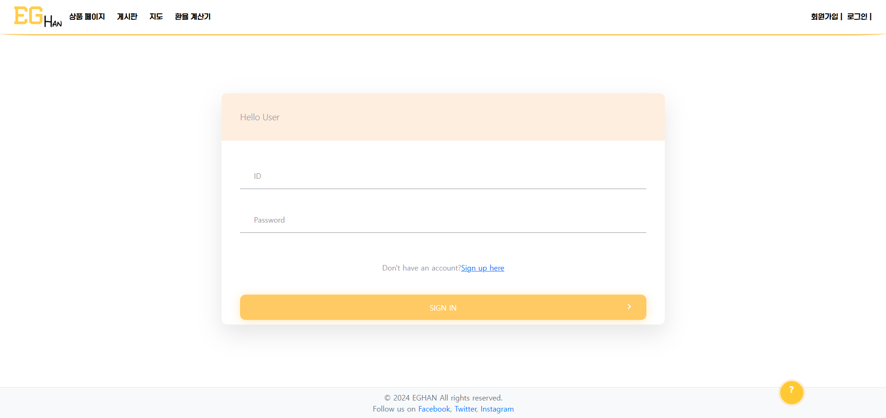

### 상품 페이지

- **예금 탭**: 시중의 예금 상품을 조회 할 수 있습니다. 탭을 통해 은행별로 상품을 모아볼 수 있습니다.
- **적금 탭**: 시중의 적금 상품을 조회 할 수 있습니다.또한 탭을 통해 은행별로 상품을 모아볼 수 있습니다.

  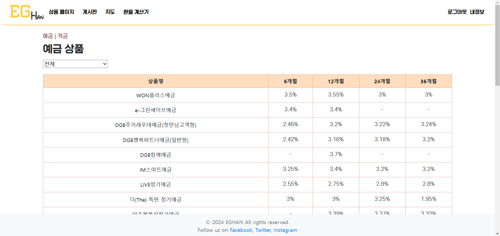
  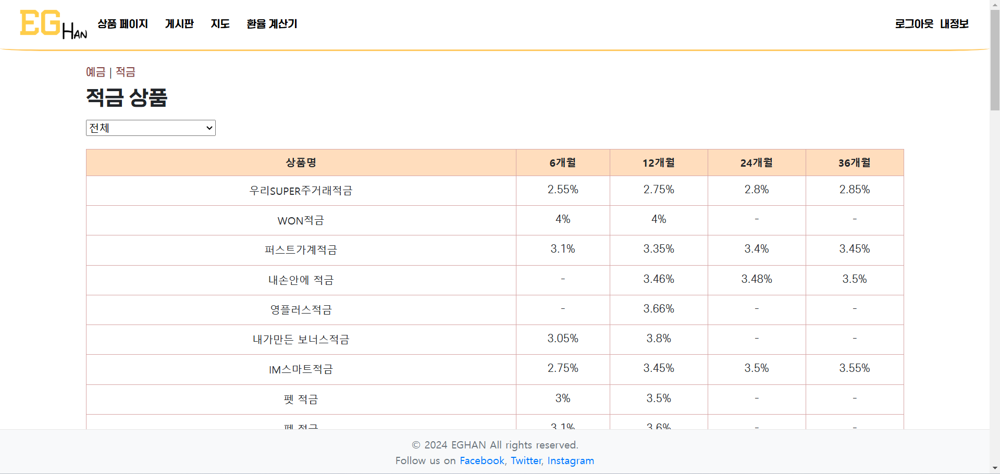

### 게시판

- **게시판 페이지**: 사용자들은 게시판 페이지를 통해 서로 소통할 수 있습니다.
- **게시판 글 작성**: 금융 상품에 관해 자유롭게 글을 작성할 수 있습니다.

  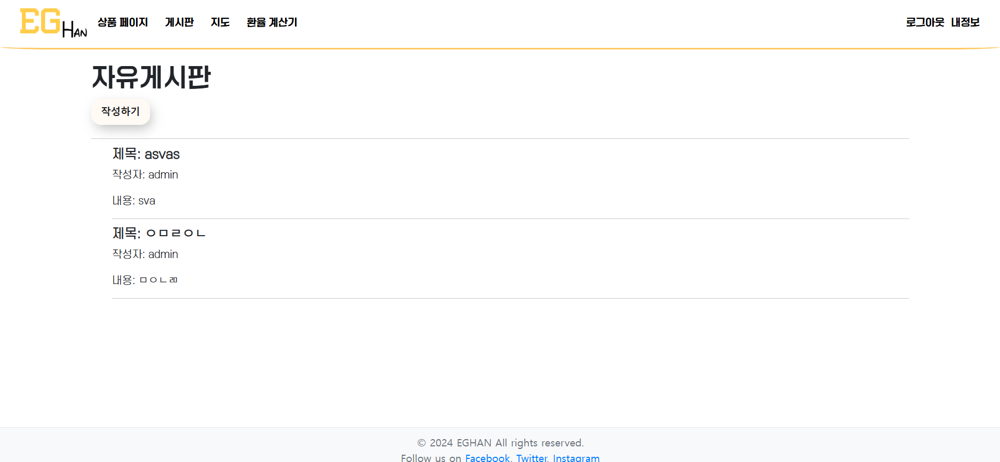
  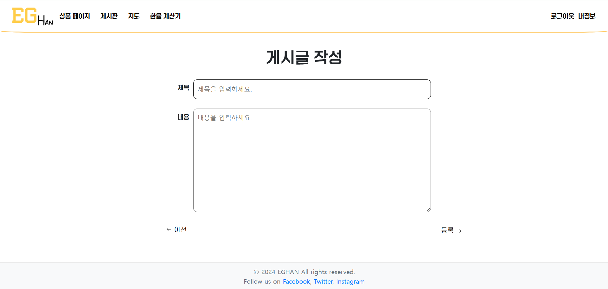

### 상품 추천 서비스

- **상품 추천 서비스**: 사용자는 자신의 연령대, 자산, 연봉 별로 상품을 추천 받을 수 있습니다.
- **상품 가입**: 사용자는 상품의 정보를 상세하게 살펴보고 가입 할 수 있습니다.
- **가입한 상품보기**: 사용자는 자신이 가입한 상품의 금리를 그래프로 확인 할 수 있습니다.

  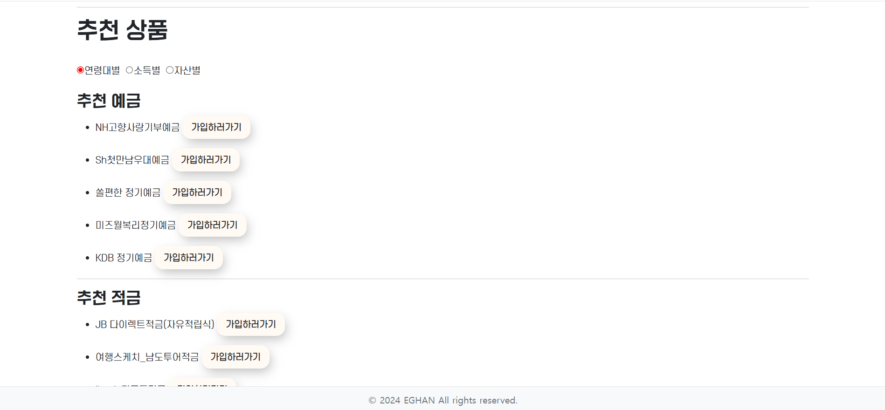
  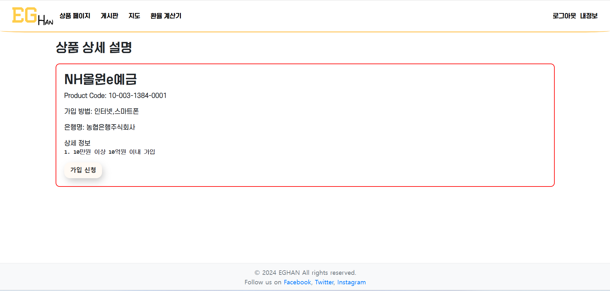

 
  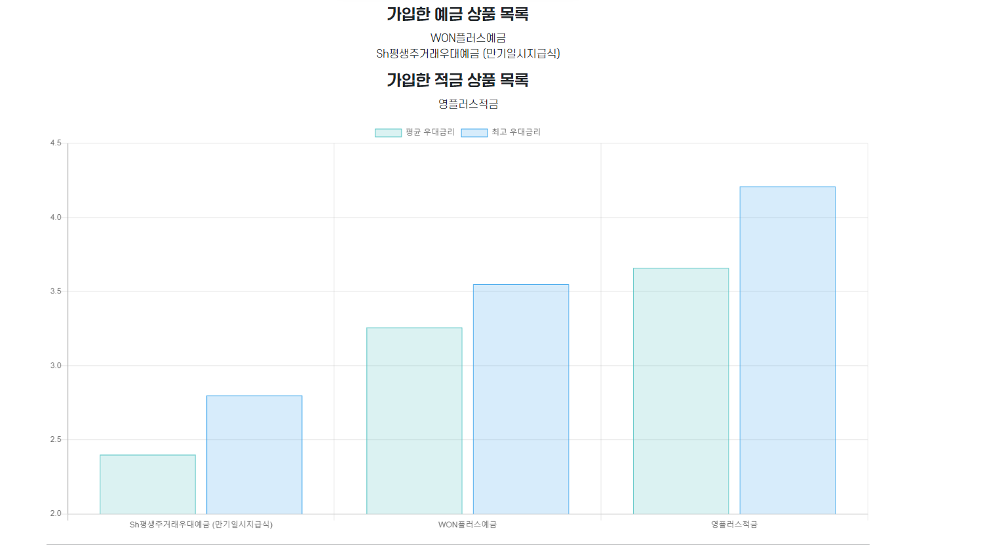

### 부가기능

- **근처 은행 찾기**: 사용자들은 근처의 은행을 찾을 수 있습니다.
- **환율 서비스** : 사용자들은 실시간 환율을 확인할 수 있습니다.
- **AI 챗봇 서비스**: 사용자들은 AI 챗봇을 통해 궁금한 점을 해결할 수 있습니다.

  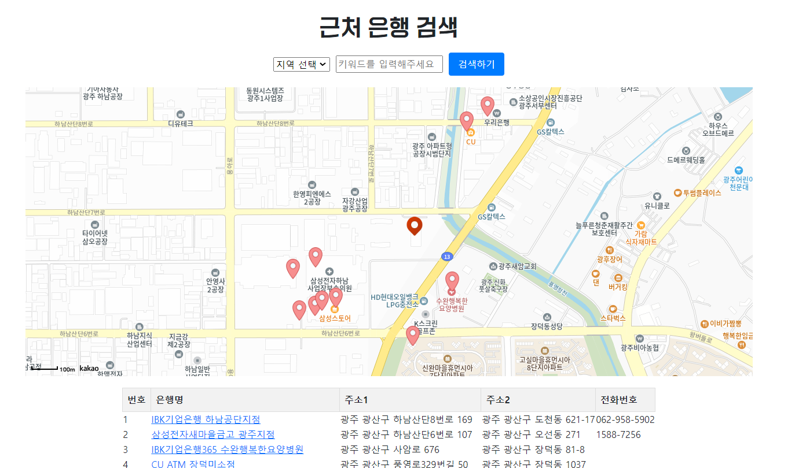
  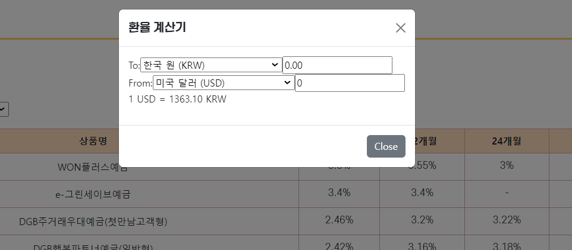

 
  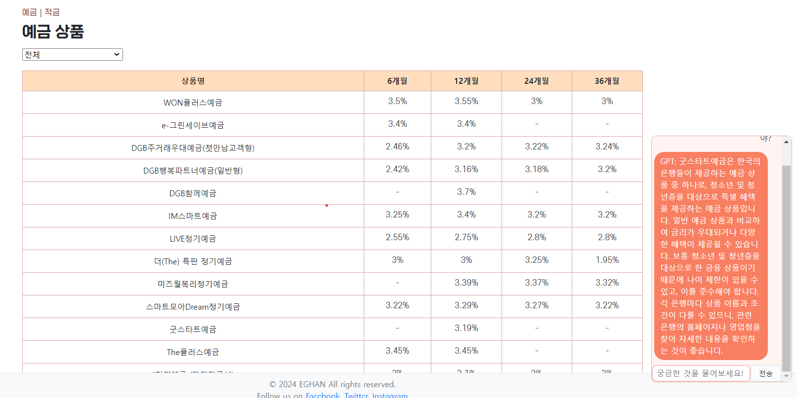

## 산출물

### **[Notion](https://frost-friction-eea.notion.site/SSAFY-b6684ce915bc4a88a868f898f71bbea7?pvs=4)**

### ERD

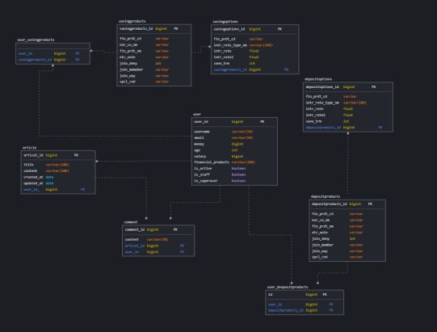

## 팀 소개

<table>
<thead>
<tr>
<th style="text-align: center;"><strong>전가현</strong></th>
<th style="text-align: center;"><strong>김성은</strong></th>
</tr>
</thead>
<tbody>
<tr>
<td align="center"><a href="https://github.com/gahyoenj">   @gahyoenj</a></td>
<td align="center"><a href="https://github.com/KSE0514">  @KSE0514</a></td>
</tr>
<tr>
<td align="center"><b>BE | FE</td>
<td align="center"><b>BE | FE</td>
</tr>
</tbody>
</table>

 
